# 🍔 Fatty House - Restaurant Landing Page

A responsive restaurant landing page built with HTML, Tailwind CSS, and JavaScript.

## 🌐 Live Demo
[View Live Site](https://fattyhouse.netlify.app/)

## 📸 Preview
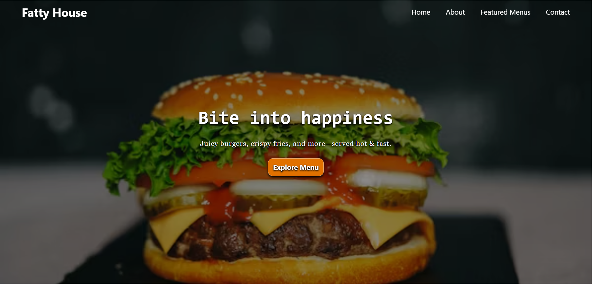
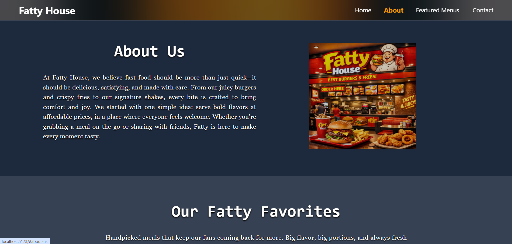
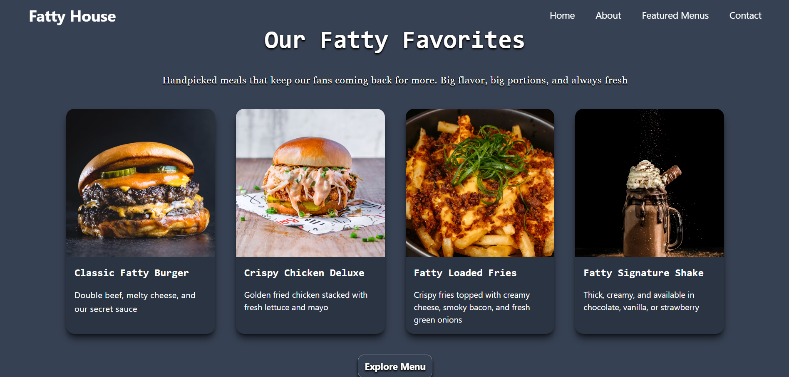
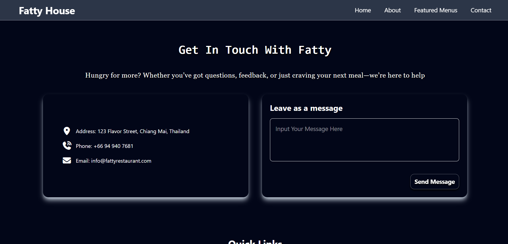

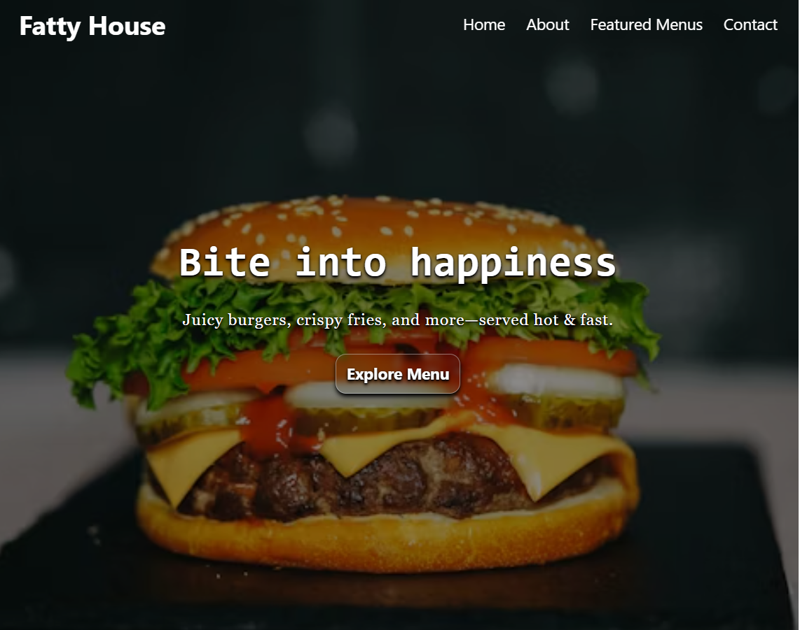
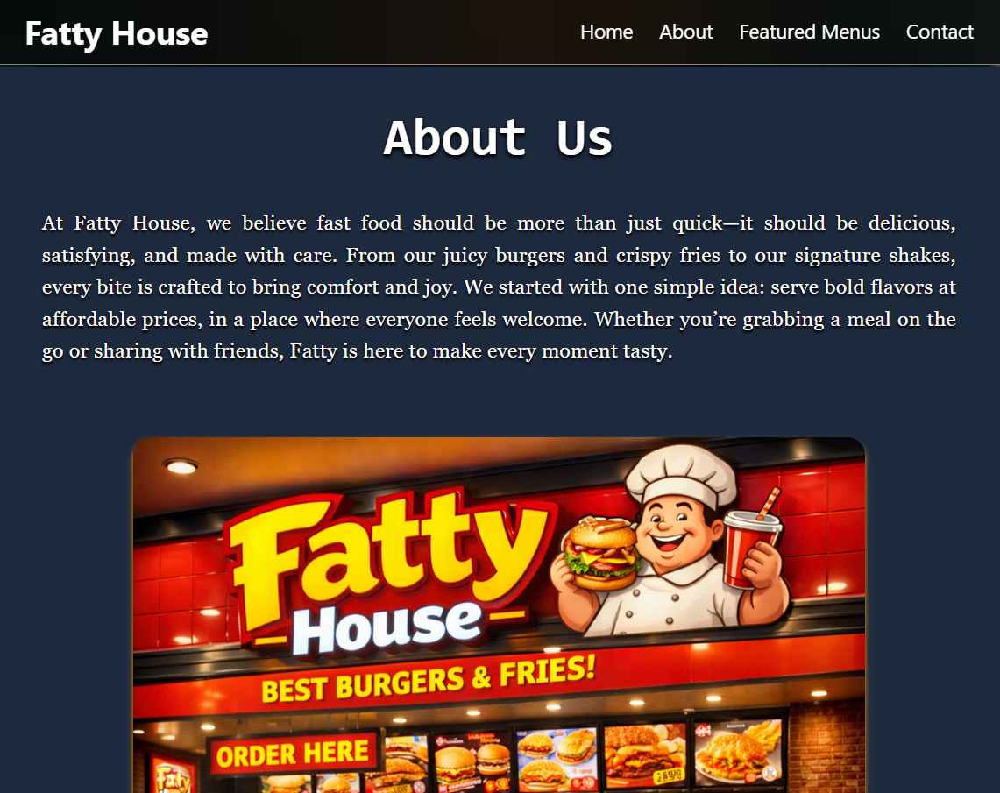
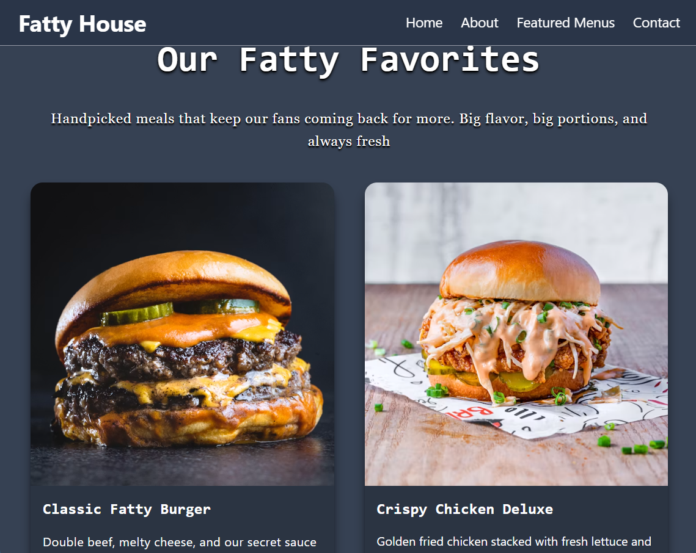
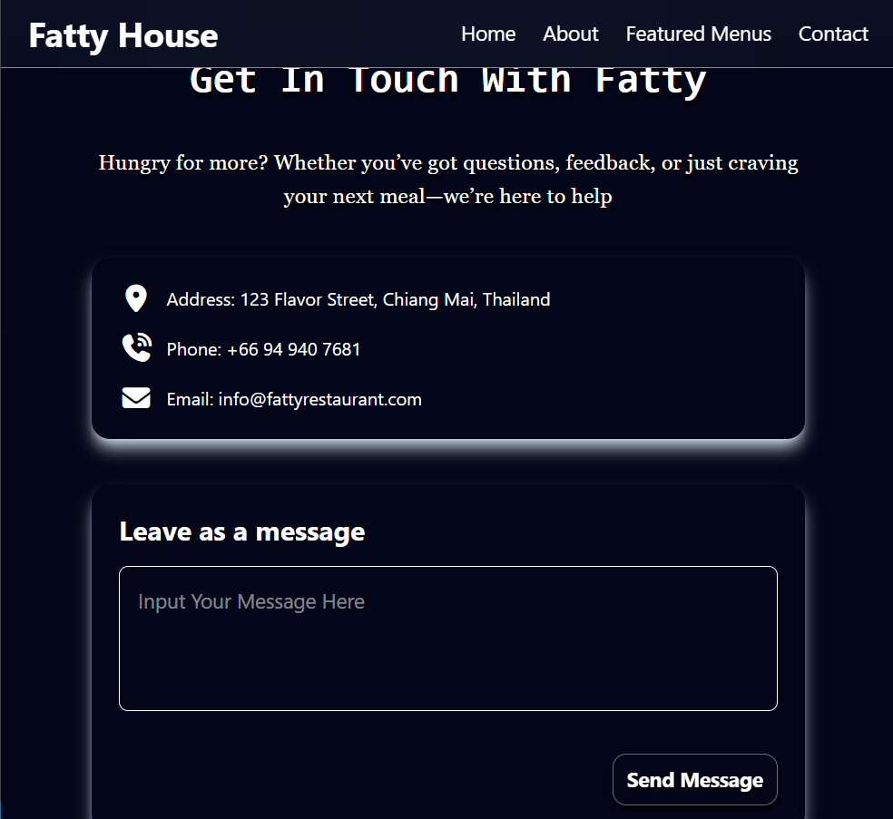
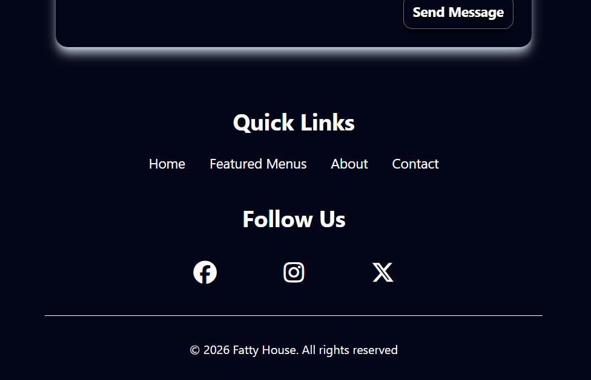
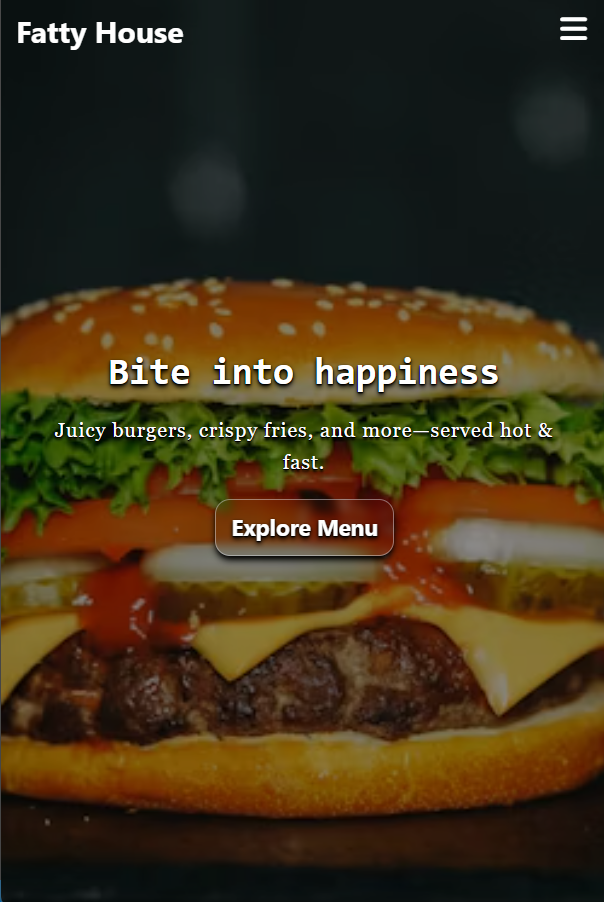
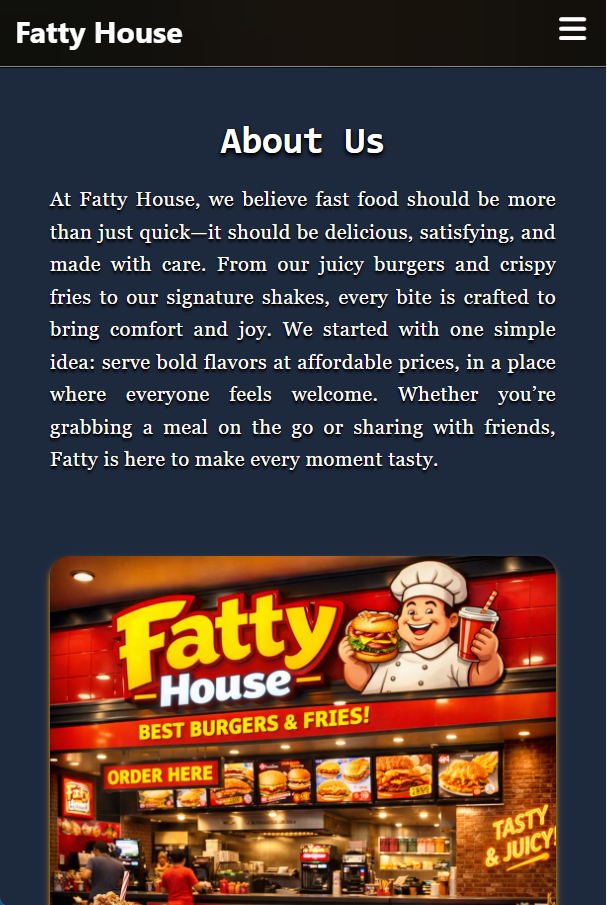
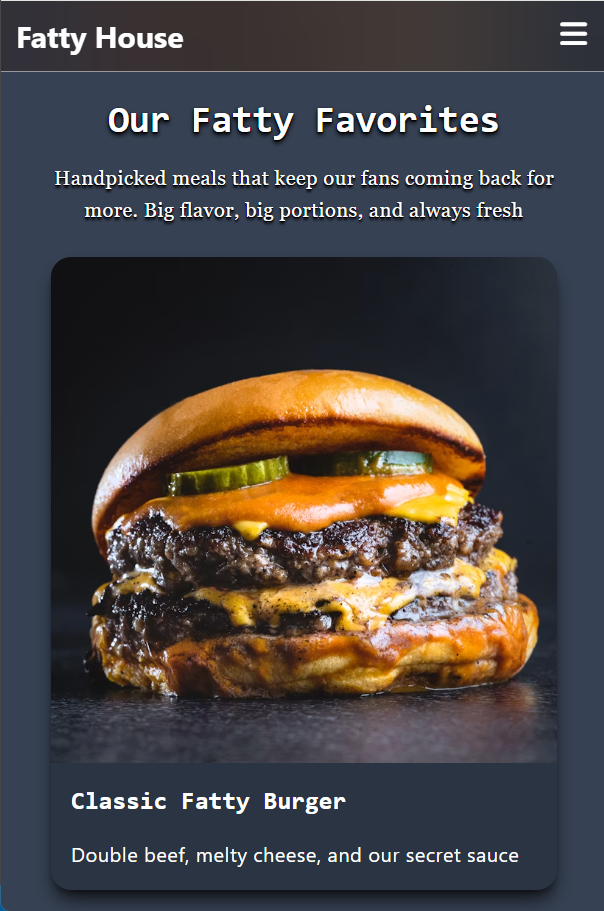
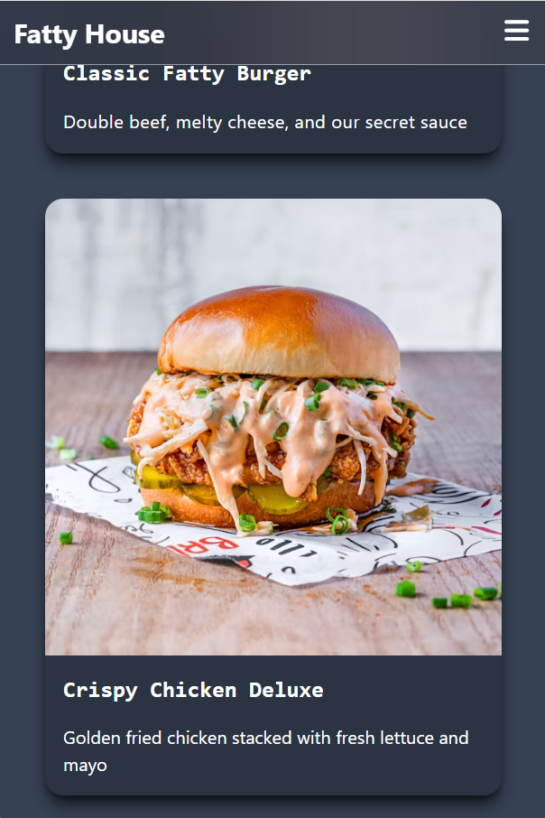
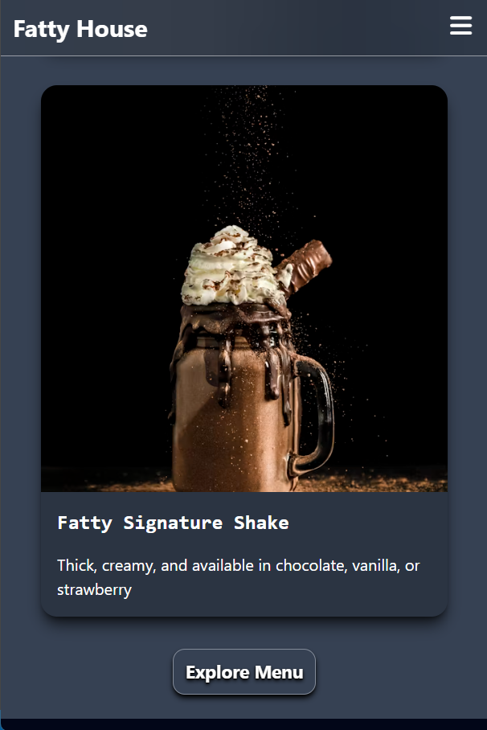
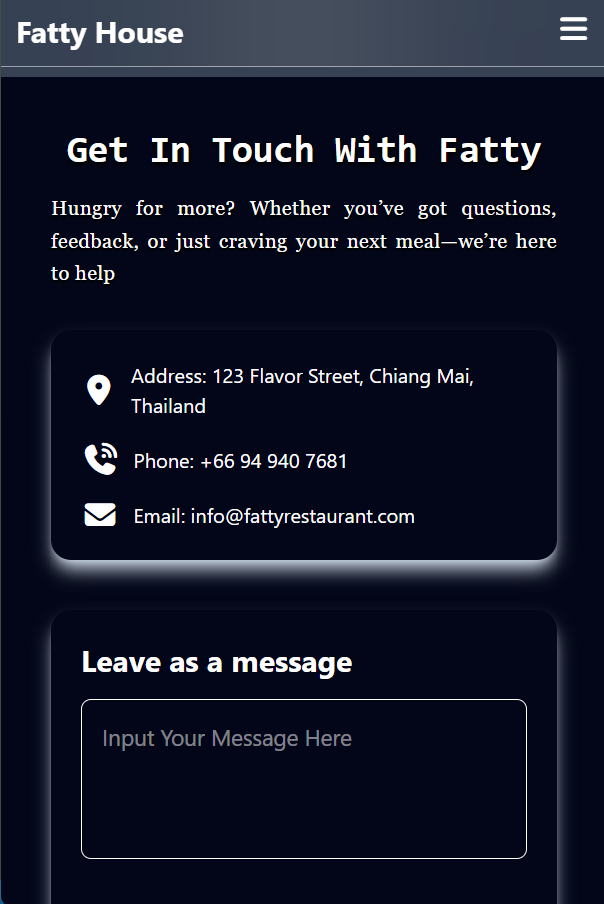
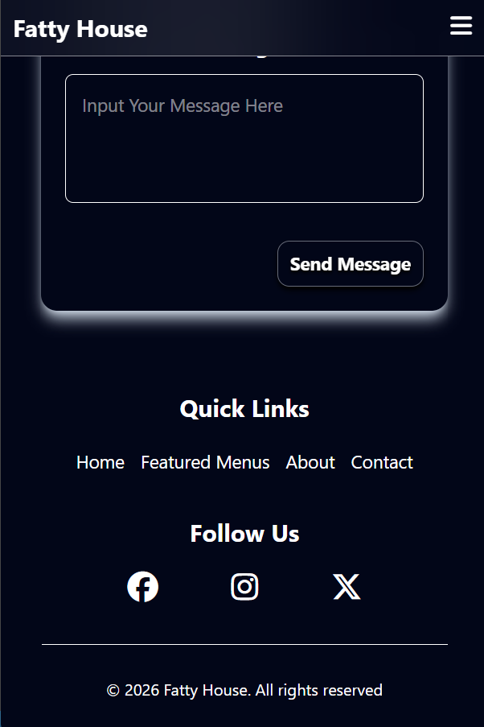

## ✨ Features
- Responsive design (Mobile, Tablet, Desktop)
- Smooth mobile menu with slide animation
- Scroll-triggered navbar effect
- Featured menu section with food cards
- Contact form with validation
- Social media links
- Smooth scroll navigation

## 🛠️ Built With
- HTML5
- Tailwind CSS v4
- JavaScript (Vanilla)
- Vite (Build Tool)
- Font Awesome Icons

## 🚀 Getting Started

### Installation
```bash
git clone https://github.com/Leo15th/Fatty-House.git
cd Fatty-House
npm install
```

### Run Development Server
```bash
npm run dev
```

### Build for Production
```bash
npm run build
```

## 📁 Project Structure
Fatty-House/
├── public/
│   └── favicon.svg
├── src/
│   ├── style.css
│   ├── main.js
│   └── script.js
├── index.html
├── vite.config.js
└── package.json

## 👨‍💻 Author
**Phyo Wai Aung**
- GitHub: [@Leo15th](https://github.com/Leo15th)
- Fiverr: [Your Fiverr Link]

## 📄 License
This project is open source and available under the [MIT License](LICENSE).